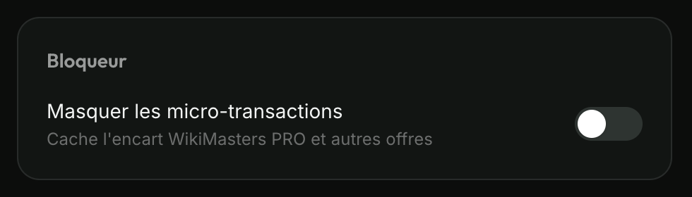
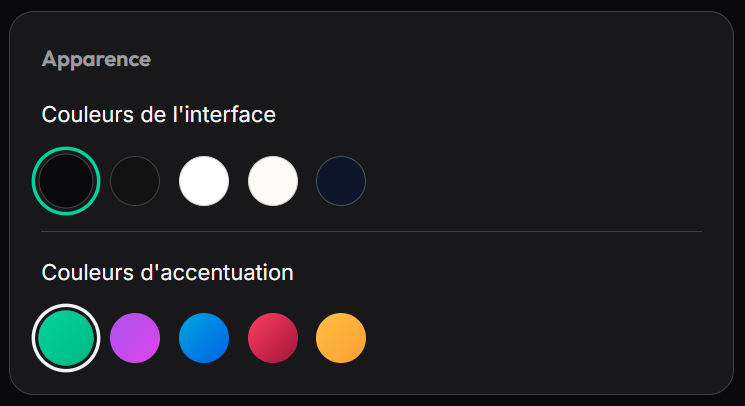
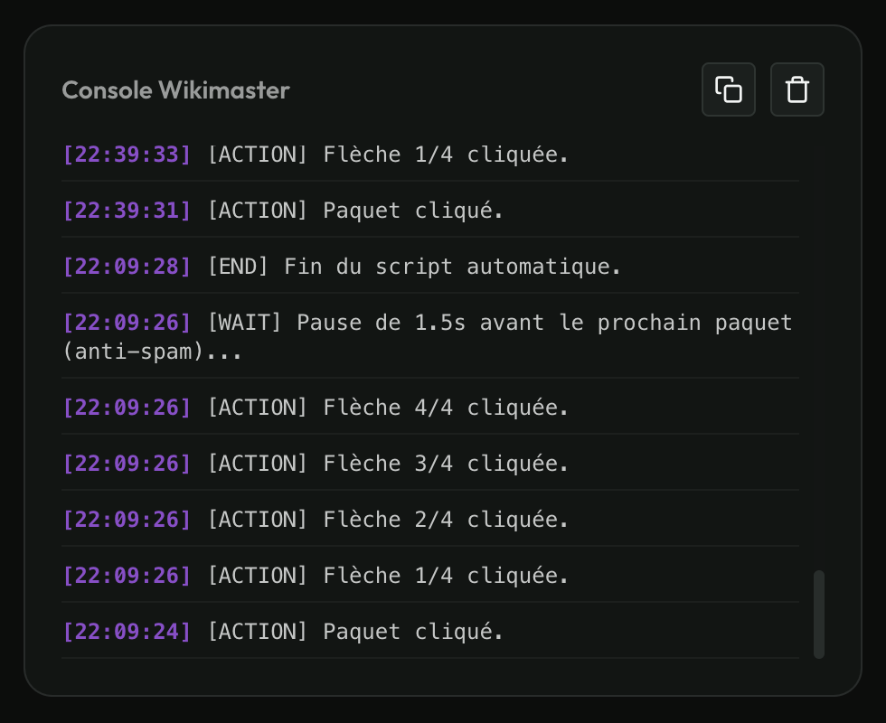

# WikiMaster Addons

**WikiMaster Addons** is a browser extension that enhances your gaming experience on [Wiki-Masters](https://www.wiki-masters.com). It provides automated features to save you time and helps you track your stats.

## Features

- **Auto-Opener ("Ouvrir Tout")**: Adds a smart button on the pack opening page (`/pulls`). A single click automatically opens all your packs in succession, saving you from clicking manually dozens of times.
- **Auto-Claim Achievements ("Tout réclamer")**: Adds a button on the achievements page (`/achievements`) that lets you claim all your unlocked achievements in a single action.
- **Micro-transaction Blocker (MTX Blocker)**: Automatically removes intrusive "WikiMasters PRO" offers, "WikiBidous" shops, and real-money purchase buttons from the game's interface. The algorithm scans and cleans the page in real time. Can be toggled in the settings.
  
  
  
- **Volume Control**: Adds an exclusive volume slider in the settings page (`/settings`) to precisely lower or mute the deafening sound effects during pack openings.
- **Advanced Theme Customization**: Take full control of the game's appearance! Replace the basic dark mode toggle with **5 Global UI Themes** (Dark Black, Dark, White, Cream, Dark Blue) and **5 Accent Colors** (Green, Purple, Blue, Red, Yellow). With 25 unique combinations, the extension dynamically overrides the game's default CSS variables and injects rich, harmonious gradients into buttons to make the interface pop!

  

- **Compact Sidebar**: Sick of scrolling the left navigation menu? This toggleable feature (in `/settings`) intelligently compresses the sidebar spacing so that all 11 tabs fit perfectly on a standard screen height (`100dvh`) without any ugly scrollbars.
- **Loading Spinner Centering**: Fixes a visual layout bug on the site where the loading animation isn't properly centered vertically. This feature can be toggled in the settings.
- **Extreme Performance Suite**: Two new toggles in `/settings` to drastically improve performance on low-end devices or slow connections:
  - **Disable Animations**: Strips all CSS animations and transitions for immediate UI rendering.
  - **Disable Images (Network Block)**: Completely intercepts and blocks all network requests for images and videos using Chrome's `declarativeNetRequest` API. Saves 100% of image bandwidth and GPU decoding power. Pack and card images are seamlessly replaced by a local lightweight WikiMaster logo, and cards dynamically adapt their background colors based on their native rarity (Common, Rare, Epic, Legendary, Mythic) so the game remains beautiful and playable even without photos!
- **Smart Polling & Anti-Spam**: The script dynamically detects on-screen elements and integrates smart safety pauses (e.g., 1.5s between packs) to avoid triggering the game's "Opening too fast" rate-limit error.
- **Debugging Console & Integrated Options**: Injects a beautiful, native-looking control panel into the game's settings page (`/settings`). Allows you to manage the MTX blocker and view, copy, or clear the extension's live logs.

  

## Installation

To install this extension on Google Chrome (or any Chromium-based browser):

1. Download or clone this repository to your computer.
2. Open your browser and go to the extensions page: `chrome://extensions/`
3. Enable **Developer mode** (toggle in the top right corner).
4. Click on **Load unpacked**.
5. Select the folder containing the extension files (`WikimasterAddons/extension/`).
6. You're all set! The extension icon will appear in your toolbar.

## Usage

1. **Opening packs**: Go to the `/pulls` page. A large green **"Ouvrir Tout"** (Open All) button will appear below your packs. Click it and let the magic happen!
2. **Claiming achievements**: Go to the `/achievements` page to use the **"Tout réclamer"** (Claim All) button.
3. **Settings and Options**: Go to the `/settings` page to:
   - Precisely adjust the volume of the game's sound effects.
   - Toggle the **Micro-transaction Blocker**, the **Compact Sidebar**, or the **Loading Spinner Centering** with a single click.
   - Boost performance by toggling **Disable Animations** or **Disable Images**.
   - Choose your favorite **Global UI Theme** and **Accent Gradient** to personalize the game's look (25 combinations available).
   - Check the **Wikimaster Console** for live extension logs.

## License

This project is licensed under the MIT License - see the [LICENSE](LICENSE) file for details.

## Tech Stack

- Modern HTML5 / CSS3 (Flexbox, CSS Variables, Native Animations)
- Vanilla JavaScript (ES6, MutationObserver)
- Chrome Extension APIs (`chrome.storage.local`, `content_scripts`, `declarativeNetRequest`, `service_worker`)
